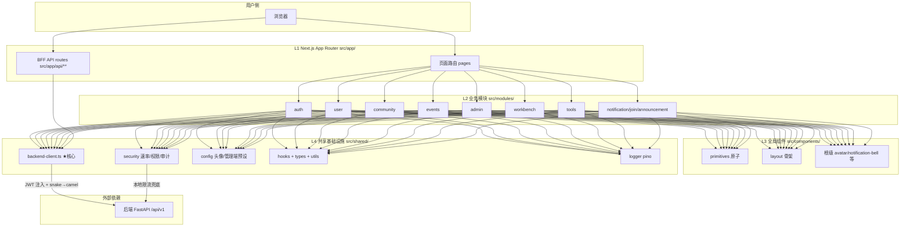
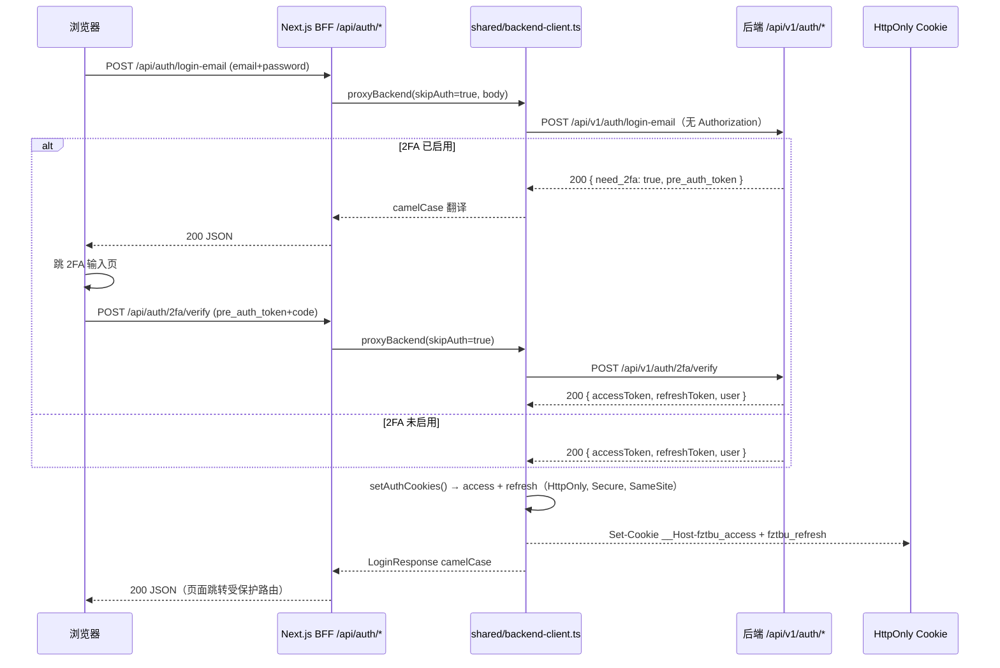
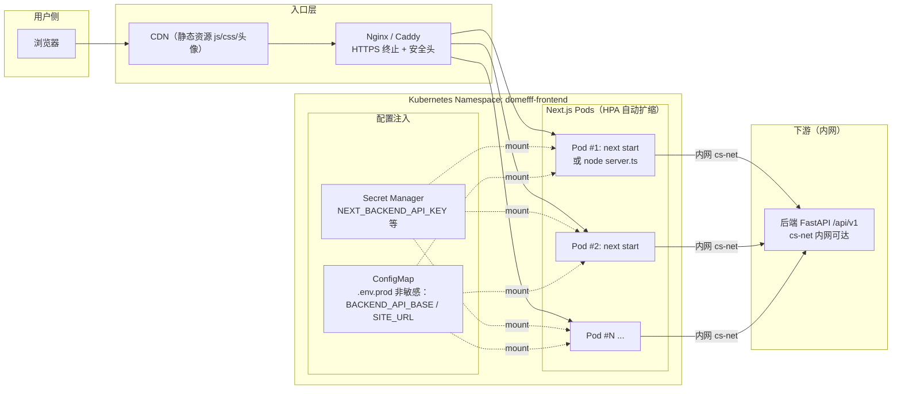

# FrontDoc-01-Arch｜前端架构设计

> 更新人：3yearsZ
> 更新日：2026-08-20
> 版本：1.0.1
> Diátaxis：E（Explanation·解释）+ L3（Arc42）
> 适用读者：前端开发者、架构评审者、新成员前端入职

读完本文，你将理解前端 BFF 的分层结构、模块边界、运行流程、部署方式与关键设计权衡。

---

## 1. 目标与约束

### 1.1 业务目标
前端为 **Next.js 16 BFF 薄转发层**，解决 3 类问题：
1. 全栈页面承载：登录注册、个人资料、活动/社区/管理后台、工作台与学习助手
2. BFF 协议转换：后端 snake_case → 前端 camelCase、JWT Cookie 托管、401 静默刷新
3. UI 设计系统落地：原子组件体系、工作台 widget 注册表、Markdown 编辑器统一

### 1.2 技术约束（不可逆）
| 约束 | 说明 |
|------|------|
| 框架 | Next.js 16 App Router + React 19 + TypeScript 5.5 |
| 语言 | TypeScript（严格模式 `strict: true`） |
| 样式 | Tailwind + `globals.css` 设计令牌；**禁止散落硬编码 hex** |
| BFF 客户端 | 自研 `shared/backend-client.ts`（Bearer 注入 + 401 静默刷新 + snake→camel）；**MUST NOT** 绕过直连 |
| 状态 | hooks + SWR + localStorage；**禁止全局事件总线**（遗留已删） |
| 测试 | Vitest 单测 437+、Playwright E2E 25+；`asyncio_mode=auto` |

### 1.3 质量目标优先级
1. **安全**（P0）：BFF 鉴权仅 UI 兜底，真实 enforce **MUST** 在后端
2. **可维护性**（P1）：纯薄转发、无本地业务库、目录按职责分层、组件复用阈值量化
3. **设计一致性**（P1）：所有页面严格遵循 `FrontDoc-UID.md` 视觉令牌
4. **性能**（P2）：Next.js Streaming SSR、widget 懒注册、无超大包

---

## 2. 上下文与范围

### 2.1 上游（调用方 = 浏览器用户）
- 桌面浏览器（Chrome / Safari / Firefox）+ 移动浏览器响应式
- 不包含移动端 MVP 触点（见 [MobileDoc-01-Arch.md](file:///Users/3yearszhuang/Documents/FztbuCS-Project/CS-Mobile/tools/docs/MobileDoc-01-Arch.md)）

### 2.2 下游（被调用方）
| 依赖 | 用途 | 强依赖？ |
|------|------|---------|
| 后端 FastAPI `/api/v1/*` | 业务逻辑、认证、RBAC、审计 | 是 |
| 前端 BFF `/api/*` | 页面层路由（Next.js）+ 薄转发 API 路由 | 是（自洽） |
| Nginx / Caddy 反向代理 | HTTPS 终止 / 静态资源 / 头安全 | 否（本地开发用 `server.ts` 直接） |
| GitHub OAuth | 第三方登录回调 | 否（未配置入口 400） |
| SMTP | 邮箱验证码（由后端承载，BFF 只转发） | 否 |

### 2.3 不在范围内
- 不包含任何直连数据库代码：旧 `src/modules/*/server/` + `shared/db/`（SQLite）已于 2026-08-06 B1 收口整体删除
- 不包含后端业务逻辑 / RBAC enforce / 审计写入：**MUST** 全由后端承载（见 [BackDoc-01-Arch.md](file:///Users/3yearszhuang/Documents/FztbuCS-Project/CS-Web-Backend/tools/docs/BackDoc-01-Arch.md)）
- 不包含 10+ 业务模块详细端点契约 / 路由表：见后续 `FrontDoc-ModuleContracts.md` 或 `openapi.baseline.json`
- 不包含设计令牌 / UI 组件规范：见 [FrontDoc-UID.md](file:///Users/3yearszhuang/Documents/FztbuCS-Project/CS-Web-Frontend/tools/docs/FrontDoc-UID.md)
- 不包含前端方法论（目录艺术、复用阈值、协作约束）：见 [RootDoc-FEArch.md](file:///Users/3yearszhuang/Documents/FztbuCS-Project/docs/RootDoc-FEArch.md)

---

## 3. 构建块视图（核心）

### 3.1 分层结构 + 模块职责
前端为经典 4 层单向 + 2 横切结构。**MUST NOT** 绕过 `backend-client.ts` 直 `fetch` 后端。

| 层级 | 根目录 | 核心模块 | 职责（1 模块 1 句话） |
|------|--------|---------|---------------------|
| L1 页面路由 | `src/app/` | `(login)` / `profile` / `events/` / `community/` / `tools/` / `admin/` + `api/**/route.ts` BFF 薄转发 | Next.js App Router 页面骨架 + BFF API 路由入口 |
| L2 业务模块 | `src/modules/`（10 个） | `auth/` `user/` `community/` `events/` `join/` `notification/` `announcement/` `tools/` `workbench/` `admin/` | 业务域 UI + 类型；`server/` 遗留层已删除 |
| L3 全局组件 | `src/components/` | `primitives/`（Button/Input 原子）、`layout/`（Navbar/Footer）、`effects/`、`feedback/`、根级 avatar/user-menu/notification-bell/theme-* | 无业务语义的跨页复用 UI（五层体系，见 RootDoc-FEArch §2.1） |
| L4 共享基础设施 | `src/shared/` | `backend-client.ts`（★核心）、`security/`（rate-limiter/origin-guard/permissions/audit）、`config/`（头像/管理端预设）、`hooks/`、`types/`、`utils/`、`logger.ts`、`app-error.ts` | 所有模块的底层依赖；**MUST NOT** 反向 import 业务模块 |

横切 1：**Next.js 自定义入口** `src/server.ts`（tsx watch 开发 / tsup 打包生产）
横切 2：**BFF 转发层** `src/app/api/**/route.ts`（无业务逻辑，只调 `backend-client.ts`）

### 3.2 10 个业务模块速览（与后端资源域对齐）
| 模块 id | 页面主路径 | 后端数据表（BFF 不直连，仅转发） |
|---------|-----------|--------------------------------|
| `admin/` | `/admin/**` | users、sessions、admin_actions（后端 PG） |
| `auth/` | `/login` `/register` | users、sessions、login_history、verification_codes、password_reset_requests |
| `community/` | `/community/**` | community_categories、community_topics、community_replies、community_likes、community_posts、community_series |
| `events/` | `/events` `/events/[id]` | events、event_registrations、event_checkins |
| `join/` | `/community/members`（入社页子区） | join_applications |
| `notification/` | `/notifications` | notifications |
| `announcement/` | 首页 / 全局横幅 | announcements |
| `tools/` | `/tools/exam` `/tools/resource` `/tools/task` `/tools/auxilio` `/tools/dev-center` | exams、exam_attempts、resources、tasks、task_claims、points_transactions |
| `workbench/` | `/tools`（页顶工作台挂于 Hero 之后） | 无独立业务表：贡献/考试/LLM/专注会话经 BFF 转发后端 |
| `user/` | `/profile` `/users/[id]` | users、activity_participations |

### 3.3 模块依赖图（Mermaid）



依赖方向约束：
1. 箭头方向唯一：页面 → 业务模块 → 组件 / 共享基础设施 → backend-client → 后端
2. 业务模块间允许 import UI/types，**MUST NOT** 互调 BFF 路由代码（统一走 `backend-client.ts`）
3. `shared/` **MUST NOT** import `modules/*` 或 `app/*`

### 3.4 BFF 前缀映射（薄转发唯一契约）
| 业务域 | BFF 前缀 | 后端目标 |
|--------|---------|---------|
| 认证 | `/api/auth/*` `/api/auth/2fa/*` `/api/auth/oauth/*` | `/api/v1/auth/*` |
| 个人资料 / 头像 | `/api/profile/*` `/api/avatars/*` | `/api/v1/profile/*` `/api/v1/avatars/*` |
| 活动 | `/api/events/*` | `/api/v1/events/*` |
| 社区（论坛 + 长文 + 成员 + Feed + 标签） | `/api/community/{community,community,members,feed,tags}/*` | `/api/v1/community/*` |
| 通知 | `/api/notifications/*` | `/api/v1/notifications/*` |
| 管理后台 | `/api/admin/{users,password-resets,events,notifications,actions,community,join,tools,announcements}/*` | `/api/v1/admin/*` |
| 工具集（考试/资源/任务/积分/Auxilio/注册表） | `/api/tools/{exam,resource,task,points,auxilio,component-registry}/*` | `/api/v1/tools/*` |
| 入社 / 会话 / 健康 | `/api/join` `/api/sessions` `/api/health` | `/api/v1/join` `/api/v1/sessions` `/api/v1/health` |
| 工作台 / LLM 配置 | `/api/workbench/*` | `/api/v1/workbench/*` |
| 开发文档（前端本地实现） | `/api/dev-docs/*` | 不转发后端，直接读 `tools/docs/*.md` |

backend-client.ts 三层职责（所有 BFF 路由 **MUST** 走）：
1. Bearer 注入（Cookie → Header）
2. 401 静默刷新（RefreshMutex 全局单飞，防刷新风暴）
3. snake→camel 响应翻译 + 错误归一化（`ClientError`）

### 3.5 关键接口（跨层契约）
| 接口 | 位置 | 契约 |
|------|------|------|
| BFF 转发客户端 | `shared/backend-client.ts` `proxyBackend()` / `proxyStream()` | JWT 注入 + 401 静默刷新 + snake→camel + Cookie 写回 |
| BFF 安全三件套 | `shared/security/` `assertAllowedOrigin()` `rateLimiter` `permissions.requireAdmin` | Origin 白名单 / 单进程内存限流兜底 / UI 层角色展示 |
| Widget 注册表 | `modules/workbench/widget-registry.ts` `WIDGETS[]` | 声明式 id/slot/titleKey/component；新增 widget 三步：声明→配置→注册 |
| Markdown 三层组件 | `modules/community/ui/community-markdown-renderer/base/editor.tsx` | 只读→基础→完整编辑器继承链；**MUST NOT** 裸 `ReactMarkdown`（**MUST** 经 `rehype-sanitize` 白名单过滤） |

---

## 4. 运行时视图

### 4.1 场景 1：邮箱登录 + 2FA（BFF 视角，时序图）



### 4.2 场景 2：工作台 Widget 渲染 + 后端聚合（Registry 驱动）

```mermaid
sequenceDiagram
    participant U as 浏览器 /tools
    participant PAGE as app/tools/page.tsx
    participant WB as modules/workbench/workbench.tsx
    participant REG as widget-registry.ts WIDGETS[]
    participant LS as localStorage（个人数据）
    participant BFF as /api/workbench/*（BFF 路由）
    participant BC as backend-client
    participant BE as 后端 /api/v1/workbench/*

    U->>PAGE: GET /tools（受保护路由）
    PAGE->>WB: 渲染工作台主体
    WB->>REG: 读取 WIDGETS[]：按 full/main/side 三 slot 分组
    WB->>LS: 读取 wb_widget_prefs（用户显隐开关）+ wb_tasks / wb_notes
    par 本地 widget（并行渲染，无需后端）
        WB->>WB: greeting-bar（本地时钟 + 会话在线时长）
        WB->>WB: today-tasks + quick-notes（localStorage 持久化）
    and 后端聚合 widget（并行 SWR 请求）
        WB->>BFF: GET /api/workbench/contributions/github
        BFF->>BC: proxyBackend(auth)
        BC->>BE: GET /api/v1/workbench/contributions/github
        BE-->>BC: 热力图（6h 缓存，可能 stale=true）
        WB->>BFF: GET /api/workbench/stats/pomodoro
        BFF->>BC->>BE: GET /api/v1/workbench/stats/pomodoro
        WB->>BFF: GET /api/workbench/llm-config（仅掩码）
        BFF->>BC->>BE: GET /api/v1/workbench/llm-config（AES Key 不回显）
    end
    alt assistant 视图（Tab 切换触发）
        WB->>BFF: POST /api/tools/auxilio/chat（SSE text/event-stream）
        BFF->>BC: proxyStream()（流式逐块推送）
        BC->>BE: POST /api/v1/tools/auxilio/chat（流式）
    end
    WB-->>U: 逐步渲染：本地 widget 先显示，后端 widget  skeleton → 数据就位替换
```

---

## 5. 部署视图

### 5.1 部署拓扑
前端为 **无状态水平扩展** BFF 层。静态资源可挂 CDN，BFF 路由由 Next.js 进程承载。



部署形态：
- 开发：单进程 `tsx watch src/server.ts`（端口 2333）
- 生产：Node.js `server.ts`（tsup 打包）或 Next.js standalone；推荐 K8s HPA
- 静态上传：头像 / 社区图片实际落于仓库根 `data/` 或后端统一对象存储

### 5.2 配置管理
| 配置类型 | 注入方式 | 示例 |
|---------|---------|------|
| **敏感**（BFF→后端 mTLS 或内部 Token，如 NEXT_BACKEND_API_KEY） | **MUST NOT** 提交 `.env`；K8s Secret / Secret Manager 注入；本地 `.env.local`（已 `.gitignore`） | `NEXT_BACKEND_API_KEY` |
| 非敏感（后端 API 基址、站点 URL、i18n 默认语） | `.env.production` / ConfigMap | `BACKEND_API_BASE=http://backend.cs-net.svc:8000` `SITE_URL=https://xxx` |
| 构建时环境变量（NEXT_PUBLIC_*） | `next.config.ts` `env` 或构建参数注入，**MUST NOT** 放敏感值 | `NEXT_PUBLIC_SITE_URL` |

### 5.3 扩缩容策略
- **已知限制**：BFF 速率限制当前为进程内存 Map（单节点模型）。多实例扩容前 **MUST** 迁移至：① 限流权威下沉后端 Redis（已做，前端仅兜底）② RBAC 权限缓存同理（后端为权威）
- 水平扩缩：HPA 触发 CPU > 70%；最小实例 = 2；最大 = 8
- 就绪探针：`/api/health`（透传后端 `/healthz`，成功才 200）；通过后 Nginx 才摘流量
- 存活探针：`/healthz`（Next.js 自身健康，不调后端）
- **MUST NOT** 本地持久化：`data/app.db` 遗留 SQLite 可安全删除（0 引用）

---

## 6. 架构决策（ADR 摘要）

| 编号 | 决策内容 | 被否决的替代方案 | 选择理由 |
|------|---------|----------------|---------|
| ADR-F01 | Next.js 16 App Router 作 BFF 薄转发 | 纯静态 SPA + 独立 Node BFF、Nuxt | App Router 流式 SSR + 文件路由 API 天然适合 BFF；团队 React 技术栈统一 |
| ADR-F02 | 纯薄转发，删除 `src/modules/*/server/` 本地 SQLite 直连层 | 保留双写（前端存用户、后端存业务） | 单一事实源（后端 PG）降低一致性风险；前端横向扩展无状态；已于 B1 收口删除 |
| ADR-F03 | 统一 `backend-client.ts` 作所有 BFF 路由入口 | 每页 route.ts 分散 `fetch` | 三层职责（Bearer 注入 / 401 静默刷新 / snake→camel）集中实现，修改一次全网生效 |
| ADR-F04 | 组件五层全局体系 + 目录即模块（workbench/widgets/pomodoro/） | 扁平 `components/` 大海 | 复用阈值量化（≥2 次才抽原子）+ 复杂组件自包含 types/hooks/constants，减少跨目录引用 |
| ADR-F05 | Widget 配置驱动 `WIDGETS[]` 注册表 | 硬编码工作台组件开关 | 新增 widget 三步（声明→配置→注册），无需改骨架；`wb_widget_prefs` 用户显隐天然适配 |
| ADR-F06 | Markdown 三层继承（Renderer→Base→Editor）+ `rehype-sanitize` | 页面各自裸 `ReactMarkdown` | XSS 防护白名单机制统一收口；编辑器与渲染器复用同渲染器；`/events/[id]` 等替换统一替换 |
| ADR-F07 | BFF 层 `requireAdmin/requireRoot` 仅 UI 兜底，权威在后端 `require_permission` | BFF 直接 enforce 权限 | 移动端直连后端绕开 BFF，后端必须单独 enforce；BFF 仅为用户体验优化（按钮灰/跳转） |

---

## 7. 风险与技术债务

### 7.1 已知风险
| 风险 | 影响 | 缓解措施 |
|------|------|---------|
| BFF 速率限制为进程内存，多实例会导致限流阈值 × N 倍 | 前端限流形同虚设 | 后端 Redis 限流为真正权威；前端仅兜底防滥用；横向扩容前 MUST 确认后端限流已覆盖 |
| `api-usage-stats` 工作台 widget 在 `WIDGETS` 未注册（后端就绪，前端缺组件） | 用户看不到 API 调用趋势 | `docs/项目待办v2.md` W-3 跟踪；新增组件后三步登记 |
| `/events/[id]` 活动详情页仍裸 `ReactMarkdown`，**未走** `rehype-sanitize` 过滤 | XSS 潜在攻击面 | 待办跟踪，下次迭代替换为统一 MarkdownRenderer |

### 7.2 技术债务（计划偿还）
| 债务 | 位置 | 严重度 | 计划偿还 |
|------|------|--------|---------|
| 通知模块前端专属测试 **MISSING**（通知列表/未读/已读） | `tools/tests/e2e/` 缺口 | P1 W-6 | 2026-09 前补齐 Playwright E2E |
| `dev-docs` 路径穿越防护仅 BFF 本地实现，未对齐 `RootDoc-Sec.md` 基线 | `src/app/api/dev-docs/**/route.ts` | P2 | 下次重构时加入白名单 slug 正则 + 路径归一化再判断 |
| `shared/events/event-bus.ts`（进程内事件总线遗留）运行时 0 引用 | 死代码 | P3 | 下个迭代删除（已无业务写入通知） |

---

## 8. 术语表

| 术语 | 定义 |
|------|------|
| BFF（Backend for Frontend） | 为前端定制的薄 API 转发层（本项目 Next.js App Router `/api/**` 承担）。**仅做协议转换，不做业务 enforce**。 |
| backend-client.ts | BFF 层唯一出口客户端。三层职责：JWT 注入 + 401 静默刷新 + snake→camel 翻译 + Cookie 写回 |
| RefreshMutex | 401 静默刷新全局单飞。并发请求共享同一次 `/auth/refresh`，避免刷新风暴与令牌竞态 |
| widget-registry | 工作台声明式配置。每个 widget 的 id/slot/titleKey/component 登记后自动渲染；显隐由 localStorage `wb_widget_prefs` 控制 |
| 五层组件体系 | primitives（原子）/ layout（骨架）/ effects（动效）/ feedback（反馈）/ root-level（跨页全局）+ 业务域 features（modules/*） |
| Markdown 三层继承链 | Renderer（只读+安全过滤） → Base（编辑/预览切换） → Editor（工具栏+图片上传）。新增 Markdown 场景 MUST 复用其中之一，禁止裸 ReactMarkdown |
| 薄转发 | BFF 路由只做代理，不写本地业务库、不做本地数据校验。真实逻辑与权限全部位于后端 FastAPI |
