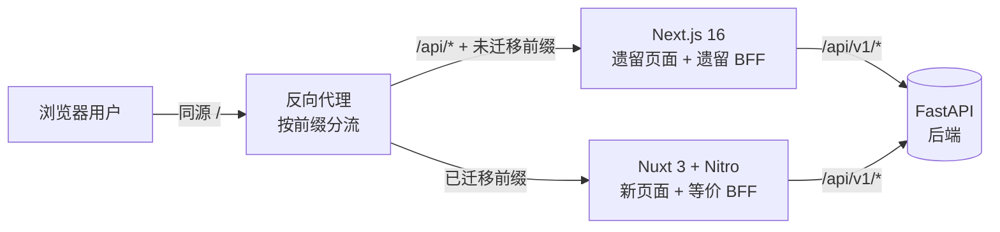

# FrontDoc-04-Migration-Vue：Web 前端渐进迁移 Vue 方案（How-to · 分层切换路线图）

> 更新人：3yearsZ
> 更新日：2026-08-25
> 版本：1.0.0
> Diátaxis：H（How-to · 回答「怎么做」，提供可执行的分阶段迁移步骤、验收点与看门命令；不展开「为什么选 Vue」的架构论证）
> 适用读者：前端开发者 / 架构评审者 / 运维；已了解 [FrontDoc-01-Arch.md](FrontDoc-01-Arch.md) 与项目构建/CI 链路
> 变更触发：渐进迁移阶段划分调整 / 共享包契约变化 / 双轨分流规则变更

> **SSOT 分工声明**：
> - 本文档是「Web 前端从 Next.js 渐进迁移到 Vue 技术栈」的唯一权威（SSOT）。
> - 前端架构总览 → [FrontDoc-01-Arch.md](FrontDoc-01-Arch.md)（Arc42）。
> - 前端安全约束 → [FrontDoc-02-Sec.md](FrontDoc-02-Sec.md)。
> - 前端实现约定 → [FrontDoc-03-Conv.md](FrontDoc-03-Conv.md)。
> - 移动端（uni-app，本就为 Vue 3）→ [MobileDoc-01-Arch.md](../../../CS-Mobile/tools/docs/MobileDoc-01-Arch.md)。

> **治理红线（RFC 2119）**：
> - MUST NOT 迁移过程中修改后端 FastAPI 代码或 `openapi.baseline.json` 契约；契约变更仅允许发生在后端侧并走既有流程。
> - MUST NOT 在 Nuxt 侧绕过 BFF 转发层直连后端；迁移后 Nuxt `server/api/**` 是唯一入口，等价于现 Next.js `src/app/api/**/route.ts`。
> - MUST 每完成一个模块迁移即满足该模块的验收看门（契约校验 + 单测 + E2E + 视觉对比），才可进入下一阶段。
> - MUST 同一 URL 前缀在任意时刻只由一个框架（Next 或 Nuxt）承接，避免双框架同时响应同一路径。
> - MUST NOT 在新框架引入新的第三方状态管理库；数据层沿用「hooks/composables + SWR 系」等价方案。
> - MUST NOT 迁移期间扩大页面功能范围；只做等价搬运，不做重构或新需求。

---

## 1. 目标与规模基线

### 1.1 迁移目标（终态）

| 域 | 当前 | 终态 |
|----|------|------|
| Web 前端 | Next.js 16 App Router + React 19 | Nuxt 3 + Vue 3 + TypeScript（strict） |
| 移动端 | uni-app + Vue 3（保持不动） | uni-app + Vue 3（消费共享契约包） |
| 共享层 | `openapi.baseline.json` → Web 端类型 | 抽取为 `@fztbucs/*` 共享包，Web/Nuxt 与移动端共同消费 |
| 后端 | FastAPI | 零改动 |

### 1.2 规模基线（迁移工作量上限依据）

| 维度 | 数量级 | 说明 |
|------|--------|------|
| 页面（`src/app/**/page.tsx`） | ~40 | 含 loading/error 边界约 50 个入口文件 |
| BFF 路由（`src/app/api/**/route.ts`） | ~150 | 纯转发，无业务逻辑 |
| 组件（`components/` + `modules/`） | ~150 | primitives/layout/effects/feedback + 10 业务模块 |
| 单测 | 437+ | Vitest + Testing Library |
| E2E | 25+ | Playwright（迁移后全量复用） |
| 业务模块 | 10 | auth/users/community/events/join/notification/announcement/tools/workbench/admin |
| 依赖替换 | 7 项 React 专属 | 见 §6 |

**结论：约 85% 工作量集中在 Web 端 UI 层重写，后端与契约不动。**

---

## 2. 总体架构：双轨分流

### 2.1 分流拓扑

迁移期内 Next.js 与 Nuxt 两个进程同时在线，由反向代理（Caddy/Nginx，现有部署已有该环节）按路径前缀分流；用户无感、同源同 Cookie。

### 2.2 分流规则（增量式）

| 前缀 | 承接方 | 迁移阶段后 |
|------|--------|-----------|
| `/api/*`（BFF） | 随模块按需切割：已迁模块的 `/api/*` 由 Nitro 承接，其余仍由 Next 承接 | 全部归 Nitro |
| 公共页面（`/`、`/login`、`/profile`、`/search`、`/notifications`） | 按阶段切换 | 全部归 Nuxt |
| `/community/*`、`/events/*`、`/tools/*`、`/admin/*` | 按阶段逐个切换 | 全部归 Nuxt |
| `/api/v1/*` | 恒为后端 | 恒为后端 |

> 说明：BFF 是页面的一等公民。**每个模块迁移时，其页面路由 + 其专属 BFF 路由必须同一切换**，保证「某个业务前缀」整体落在单一框架内，规避跨框架鉴权/Cookie 状态分裂。

### 2.3 Nuxt 侧 BFF 等价实现

- Next `route.ts` → Nuxt `server/api/**/*.ts`（Nitro 文件式路由，约定基本一致）。
- 现 `src/shared/backend-client.ts`（Bearer 注入 + 401 静默刷新 + snake→camel）抽为框架无关实现（fetch 直接调用，不依赖 React/Next API），供 Nitro 复用；若现状实现与 Next 环境强耦合，则先解耦再抽取（Phase 0 任务）。
- `check-bff-boundary` 脚本需适配：校验范围从 `src/app/api` 扩展/迁移到 `server/api`，规则不变（MUST NOT 直连后端）。

---

## 3. 共享层抽取（Phase 0 交付物）

统一技术栈的实质收益在共享层，抽取顺序固定：

| 包名 | 内容 | 消费者 |
|------|------|--------|
| `@fztbucs/contract-types` | `openapi.baseline.json` 生成的类型 + snake→camel 映射（现 `src/shared/api/backend-api.d.ts` + 手工映射注释） | Nuxt、移动端、后端测试（备选） |
| `@fztbucs/core` | 纯逻辑：token/类型守卫/状态映射/表单校验/日期工具（无 UI 依赖） | Nuxt、移动端 |
| `@fztbucs/bff-client` | 框架无关 BFF 客户端（backend-client 解耦版） | Nuxt（Nitro） |

- 共享包 MUST 以 TS 源码 + 编译产物双形式发布（monorepo workspace 内直接用源码，CI 产物留给外部消费）。
- 移动端参与度：仅引入 `contract-types` 与 `core` 的纯逻辑，**不引入 BFF 客户端**（移动端直连后端 token 模式，与 Web 不同，见 [MobileDoc-01-Arch.md](../../../CS-Mobile/tools/docs/MobileDoc-01-Arch.md)）。
- 移动端单测/类型随包更新走 CI，不改其运行时框架。

---

## 4. 分阶段路线

每阶段固定交付：**迁移模块页面 + BFF 路由 → 补单测 → E2E 全绿 → 视觉对比过 → 切换 gateway 分流 → 清理 Next 侧旧路由（保守：先注释/归档，最后统一删除）**。

| 阶段 | 范围 | 集成点 | 阶段产出 |
|------|------|--------|---------|
| **P0 准备** | 共享包抽取、Nuxt 骨架（Nitro BFF + vue-i18n + Tailwind 令牌搬运）、gateway 分流、CI 双轨（Next+Nuxt 并行构建） | 无页面切换 | 三共享包可用、Nuxt 起服务、`make check` 扩展适配 |
| **P1 认证与用户域** | `/login`、`/register`、2FA、会话、`/profile`、`/about`；对应 auth/profile/sessions/2fa BFF 路由 | P2 起步依赖 | 最小闭环验证（登录→改密→会话），替换了 7 项依赖中的 next-themes/i18n 接入 |
| **P2 社区** | `/community/*`（列表/详情/草稿/系列/标签）+ 社区 BFF 路由 + 社区管理面板 | P3 | markdown 编辑器/渲染器 Vue 化（react-markdown 替换完成） |
| **P3 活动** | `/events/*`（列表/详情/注册/日历/时间轴）+ 活动 BFF 路由 | P4 | 日历/时间轴组件 Vue 化 |
| **P4 工具域** | `/tools/*`（exam/resource/task/points/auxilio/dev-center/component-registry）+ 对应 BFF 路由 | P5 | 拖拽（@dnd-kit→vuedraggable）、AI 助手会话页迁移 |
| **P5 工作台与全局** | `/workbench/*`、`/search`、`/notifications`、公告横幅、首页 `/` | P6 | widget 注册表 Vue 化（schema 驱动不变） |
| **P6 管理后台** | `/admin/*` 全量（用户/角色/权限/事件/工具/审计）+ admin BFF 路由 | P7 | RBAC 权限矩阵、批量管理表格迁移完成 |
| **P7 收尾** | 拆除双轨：Next 进程下线、gateway 精简、Next 专属脚本/依赖清理、文档回归（FrontDoc-01/03/04、CI 简化） | — | 单框架交付 |

> 排序原则：P1 先做打通链路的最小闭环；P2 社区是「页面最多、组件最复杂」的模块，放早期验证复用体系；P6 管理后台模块间依赖最强，放最后降低返工。

---

## 5. 每阶段验收看门（DoD）

每阶段完成 MUST 全部通过，缺一不可：

| 看门 | 命令/动作 | 说明 |
|------|-----------|------|
| 类型检查 | `tsc` / `vue-tsc --noEmit` | Nuxt 侧 strict 全绿 |
| Lint | ESLint（双框架各自配置） | 无新增 error |
| 单测 | Vitest（新模块）+ 存量保留 | 迁移模块补足覆盖，单测总数不降 |
| E2E | Playwright 全量回归 | 25+ 用例必须全绿（含已迁页面断言不变） |
| 契约 | `make check` 中 contract 阶段 | `openapi.baseline.json` 与后端一致（过滤 test 路由） |
| BFF 边界 | `check-bff-boundary`（适配后） | 无直连后端、无约定违反 |
| 视觉对比 | 黄金截图对比（已迁页面 before/after） | 与 `FrontDoc-UID.md` 令牌一致，无硬编码色 |

---

## 6. React 专属依赖替换清单

| 现依赖（React） | Nuxt/Vue 替代 | 迁移阶段 |
|----------------|---------------|---------|
| next-intl | vue-i18n（message 文件 `src/i18n/messages/*` 直接迁移） | P0/P1 |
| next-themes | 自研 composable（简单主题切换） | P0/P1 |
| react-markdown + rehype/remark | md-editor-v3 或 markdown-it + highlight | P2 |
| @dnd-kit/* | vuedraggable（组件化拖拽） | P4 |
| lucide-react | lucide-vue-next | P0（图标替换随模块迁移） |
| motion（framer） | motion 官方 Vue 版 | 随各模块 |
| swr | swrv（保持 hook 心智）或 TanStack Query | P0/P1 |
| React Server Components / Streaming | Nitro + Nuxt `useAsyncData`（等价数据形态，非 RSC） | 全期 |

> Tailwind 4、`globals.css` 令牌、`FrontDoc-UID.md` 视觉规范、`.design_library` 组件规范 JSON 全为框架无关，原样复用。

---

## 7. 风险与预案

| # | 风险 | 预案 |
|---|------|------|
| 1 | 双框架并存期依赖与构建复杂度上升 | P0 起双轨 CI 并行；收紧验证：任何提交必须双框架各自 lint/build 过 |
| 2 | 等价搬运中出现"顺手重构"漂移 | 红线已禁；E2E 断言 + 视觉对比截图作为等价性裁判 |
| 3 | backend-client（401 刷新/cookie）解耦后行为不一致 | P1 即为最小闭环验证，专门加"登出→刷新→401 续期"系列 E2E |
| 4 | 双框架同源 Cookie/Session 冲突 | 分流规则保证同前缀单框架承接；P1 验收覆盖跨模块会话连续性 |
| 5 | 迁移周期过长导致文档/检查脚本失效 | 每阶段结束即更新 FrontDoc-04 状态表与 check 脚本，禁止"最后统一补" |
| 6 | 移动端共享包引入破坏其构建 | contract-types/core 为纯 TS 无运行时依赖；移动端 CI 加类型检查门禁 |

---

## 8. 收尾（P7 完成后）

- 删除 `src/app/api`（Next BFF）、Next 专属 `next.config.ts`/`server.ts` 构建脚本、`next-intl` 等依赖。
- 反向代理收敛为单上游，清除旧前缀。
- CI 从双轨降为单轨；`check-bff-boundary`、`gen:bff-routes` 等脚本改指 Nuxt 目录。
- 归档本文档状态为「已完成」，迁移状态表更新到终态。

---

## 9. 迁移状态表（跟踪）

| 阶段 | 状态 | 完成日期 | 备注 |
|------|------|---------|------|
| P0 准备 | 未开始 | - | - |
| P1 认证与用户域 | 未开始 | - | - |
| P2 社区 | 未开始 | - | - |
| P3 活动 | 未开始 | - | - |
| P4 工具域 | 未开始 | - | - |
| P5 工作台与全局 | 未开始 | - | - |
| P6 管理后台 | 未开始 | - | - |
| P7 收尾 | 未开始 | - | - |

---

## 10. 每阶段启动清单（执行 Pn 前 MUST 逐项勾选）

- [ ] 前置阶段验收看门（§5）全部通过、状态表已更新
- [ ] 本阶段路由分流规则已在 gateway 声明（A/B 流量规则：先灰度小流量，再全量）
- [ ] 本阶段 BFF 路由已在 Nitro 侧等价实现，`check-bff-boundary` 通过
- [ ] 依赖替换项（§6）已落地且无残留 React 专属 import（`grep` 门禁在 CI 中）
- [ ] 单测/E2E/视觉对比基线就绪
- [ ] 灰度验证：分流小流量观察日志与监控无异常后全量切换